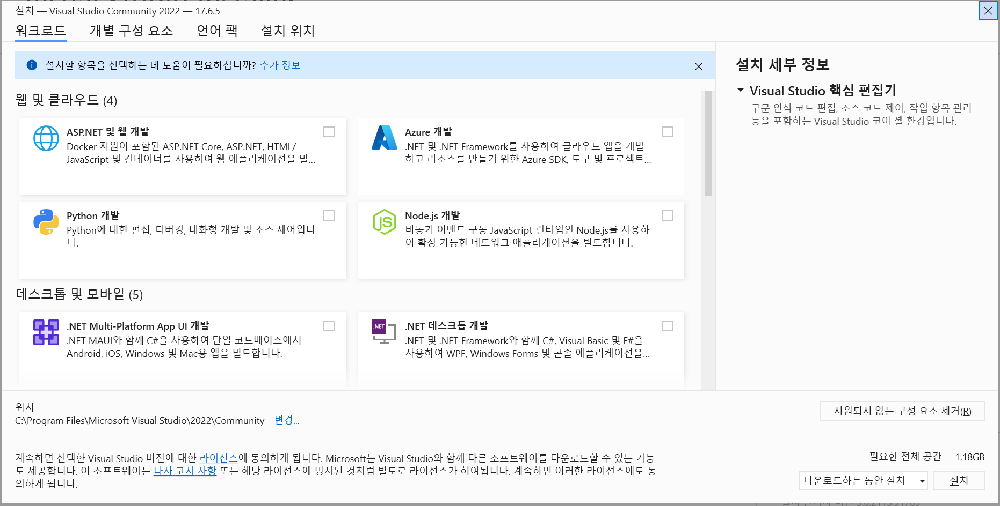

# Visual Studio Community

visual Studio Community는 MSVC 컴파일러를 사용하여 VSCode에서 사용할 G++ 컴파일러와는 차이가 있을 수 있음

https://visualstudio.microsoft.com/ko/downloads/

에서 Community 선택   
다운로드 폴더에 설치된 VisualStudioSetup 실행

- **Visual Studio Community 2022 Installer 화면**

</img>   

 

### Visual Studio Installer의 상위 메뉴   

> **워크로드** : 개발 환경 템플릿(해당 플랫폼을 개발하기 위해 필요한 모음집 같은 것)을 선택해서 설치할 수 있음   
>
> **개별 구성 요소** : 개발 환경에서 부분적인 요소를 선택해서 설치할 수 있다. (잘 모르면 스킵)   
> 
> **언어 팩** : 한국어, 영어 둘 중 하나 선택해서 설치 
>
> **설치 위치** : 설치를 위해선 공간이 어느정도 필요하기 때문에 용량이 부족하다면 설치 위치를 변경해야 함.   

워크로드에서 자신의 목적에 맞게 아래의 것들을 체크하고 설치

- 필수항목   
C++을 사용한 데스크톱 개발    

- 선택항목   
.NET 데스크톱 개발 (.NET 프레임워크/C#/WPF/Windows Form 등을 독학 할 경우)   
Python 개발 (Visual Studio에서 Python도 이용할 경우)   

오른쪽 아래의 설치를 누르면 설치 시작

Visual Studio Community는 기본적으로 MSVC 컴파일러 사용

  

# Visual Studio Code

기존 MinGW의 GNU/GCC/G++컴파일러를 이용하여 사용   

Code Runner Extension을 이용하면 기존에 실행하던 방법 그대로 사용이 가능 (확장자명 .cpp)   

VSCode창에서 Ctrl + Shift + P 키를 눌러 '명령어 팔레트' 상단에 호출    

C/C++: Edit Configurations(UI) 검색하고 선택   

- 설정화면   

</img>   

 

Compliler Path    
**MinGW 파일 경로 \bin\g++.exe** 입력

IntelliSense mode   
**windows-gcc-x86** 선택

이제 Code runner extension을 이용하여 간편하게 실행하면 된다.

  

## vscode 디버깅

VSCode는 IDE(Integrated Development Environment/통합 개발 환경) 설정을 **.vscode** 폴더에 저장해 사용한다.   
디버깅은 해당 폴더에 있는 아래 설정 파일의 값을 조정하여 디버깅을 할 수 있게 한다.

.vscode 폴더의 ``launch.json``, ``tasks.json`` 두개의 파일을 옮겨 사용한다.   

디버깅은 빌드 -> 디버깅 순으로 실행되어야 한다.   

 

### - launch.json

왼쪽 메뉴의 Run and Debug (또는 Ctrl + Shift + D)    
**Run and Debug** 버튼 -> launch.json 파일이 없을시 **Create a launch.json**로 launch.json 파일 생성
 

중간의 "miDebuggerPath" 인자 부분경로를 위의 컴파일러 경로(Compiler Path)로 변경     
! 컴파일러 경로가 있는 부분은 전부 자신의 환경에 맞추어 변경

### - tasks.json

중간의 "Command" 인자 부분경로를 위의 컴파일러 경로(Compiler Path)로 변경   
! 컴파일러 경로가 있는 부분은 전부 자신의 환경에 맞추어 변경

